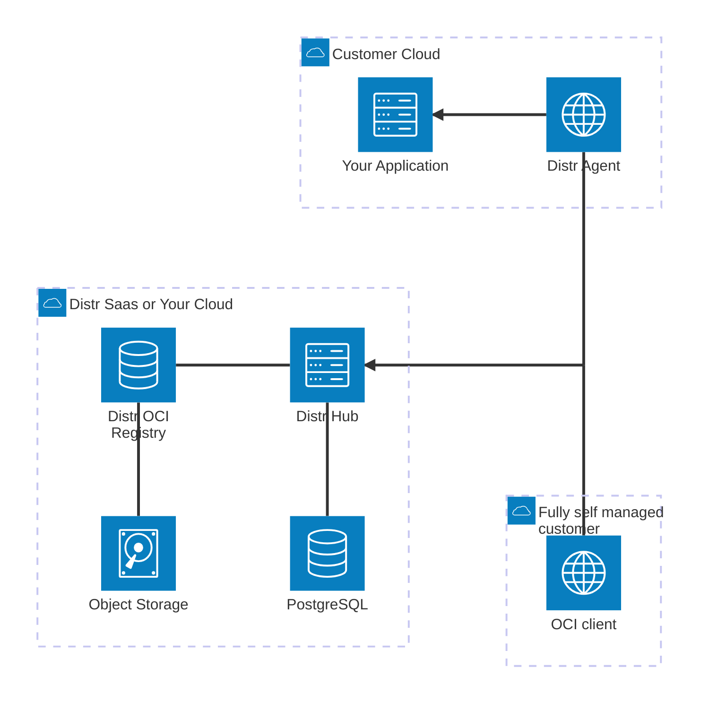

<br>
<div align="center">
  <a href="https://glasskube.dev?utm_source=github">
    
  </a>
<h1 align="center">Distr</h1>
<br>
<h2>Software Distribution Platform</h2>

Distr enables software and AI companies to distribute applications to self-managed customers with minimal setup.

### **[Website](https://glasskube.dev/?utm_source=github)** • **[Quickstart](https://distr.sh/docs/getting-started/quickstart/?utm_source=github)** • **[Documentation](https://distr.sh/docs/getting-started/about/?utm_source=github)** • **[Blog](https://glasskube.dev/blog/)** • **[Twitter](https://x.com/glasskube)** • **[Discord](https://discord.gg/6qqBSAWZfW)**

<hr>

[](https://github.com/distr-sh/distr)
[](https://opensource.org/licenses/Apache-2.0)
[](https://artifacthub.io/packages/helm/distr/distr)


<hr>

</div>

## Main features

- **Centralized Management:** View & manage all deployments, artifacts, connected agents, self-managed & BYOC customers via the intuitive web UI
- **Deployment Automation:** Optional prebuilt Helm and Docker agents manage deployments, collect logs and metrics, and allow remote troubleshooting.
- **White-label customer portal:** Let your customers control their deployments or download your artifacts
- **License Management:** Distribute specific versions of your application to specific customers
- **Container registry:** Distribute OCI-compatible artifacts (Docker images, Helm charts, Terraform modules) with built-in granular access control and analytics.
- Access the API using our [**rich SDK**](#distr-sdk)
- Fully Open Source and [self-hostable](#self-hosting)

Check out the hosted version at https://distr.sh/get-started/.

## About

Distr is an Open Source software distribution platform that provides a ready-to-use setup with prebuilt components to help software and AI companies distribute applications to customers in complex, self-managed environments.

**Use cases include:**

- On-premises, VPC and self-managed software deployments
- Bring Your Own Cloud (BYOC) automation
- Edge & Fleet management

Read more about Distr and our use cases at https://distr.sh/docs/getting-started/about/

## Architecture overview



## Self-hosting

In case you get stuck, have questions, or need help, we're happy to support you,
drop by our [Discord](https://discord.gg/6qqBSAWZfW).

### Docker

The Distr Hub is distributed as a Docker image via ghcr.io.
Check out [`deploy/docker`](deploy/docker) for our example deployment using Docker Compose.
To get started quickly, do the following:

```shell
mkdir distr && cd distr && curl -fsSL https://github.com/distr-sh/distr/releases/latest/download/deploy-docker.tar.bz2 | tar -jx
# make necessary changes to the .env file
docker-compose up -d
```

### Kubernetes

Distr is also available as a Helm chart distributed via ghcr.io.
Check out [`deploy/charts/distr`](deploy/charts/distr) for our Helm Chart source code.
To install Distr in Kubernetes, simply run:

```shell
helm upgrade --install --wait --namespace distr --create-namespace \
  distr oci://ghcr.io/distr-sh/charts/distr \
  --set postgresql.enabled=true --set minio.enabled=true
```

For a quick testing setup, you don't have to modify the values.
However, if you intend to use distr in production, please revisit all available configuration values and adapt them accordingly.
You can find them in the reference [values.yaml](https://artifacthub.io/packages/helm/distr/distr?modal=values) file.

<hr>

Register your first account at http://localhost:8080/register

The full self-hosting documentation is at https://distr.sh/docs/self-hosting/self-hosting/

Using Distr agents on macOS? Follow the [guide](https://distr.sh/docs/guides/distr-on-macos/) to get started.

### Building from source

To build Distr Hub from source, first ensure that the following build dependencies are installed:

- NodeJS (Version 22)
- Go (Version 1.25)
- Docker (when building the Docker images)

We recommend that you use [mise](https://mise.jdx.dev/) to install these tools, but you do don't have to.

All build tasks can be found in the `mise.toml` file, for example:

```shell
# Build the control plane
mise run build:hub
# Build all docker images
mise run "docker-build:**"
```

### Local development & Contributing

Check out our [contributing guidelines](./CONTRIBUTING.md).

## Distr SDK

Interact with Distr directly from your application code using our first-party SDK.
The Distr SDK is currently available for JavaScript only, but more languages and frameworks are on the roadmap.
Let us know what you would like to see!

You can install the Distr SDK for JavaScript from [npmjs.org](https://npmjs.org/):

```shell
npm install --save @glasskube/distr-sdk
```

The full SDK documentation is at https://distr.sh/docs/integrations/sdk/

## Distr MCP server

Use the Distr MCP server to connect your deployments, applications, artifacts and licenses to agentic workflows,
or to interact with the Distr platform in LLM Clients.

The Distr MCP server is hosted on HyprMCP ([hyprmcp.com](https://hyprmcp.com/) & [`hyprmcp/jetski`](http://github.com/hyprmcp/jetski/)).
It can either be used as a Remote MCP server via the streamable HTTP protocol or used locally via stdio.

> [!NOTE]  
> The Distr MCP server requires authentication via a personal access token.

Configure a [personal access token (PAT)](https://distr.sh/docs/integrations/personal-access-token/)
in an `Authorization` header when calling the MCP server.

**Header name:** `Authorization`
**Header value:** `AccessToken distr-bc46...`

Example configuration for Claude Code would look like:

```shell
claude mcp add --transport http distr https://glasskube.hyprmcp.cloud/distr/mcp --header "Authorization: AccessToken distr-bc46..."
```

The full MCP Server documentation is at https://distr.sh/docs/integrations/mcp/
