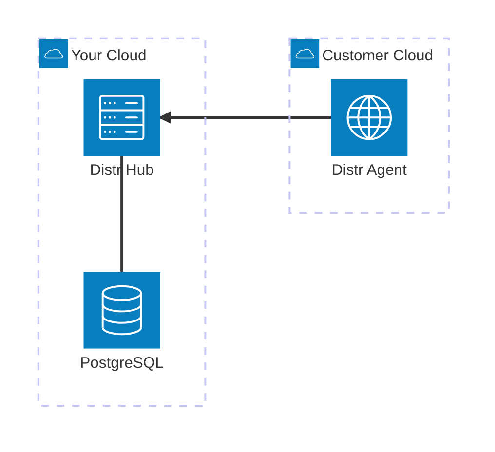

<h1 align="center">
  <a href="https://distr.sh/" target="_blank">
    
  </a>
  <br>
  distr.sh
</h1>

<div align="center">

**Software Distribution Platform**

</div>

[](https://github.com/glasskube/distr)
[](https://opensource.org/licenses/Apache-2.0)
[](https://glasskube.dev/products/distr/docs/?utm_source=github)

Distr is the easiest way to distribute enterprise software to customer-controlled or shared-responsibility environments.

- View all deployments and connected agents via the **intuitive web UI**
- Let your customers control their deployments via the **white-label customer portal**
- Access the API using our [**rich SDK**](#distr-sdk)
- Fully open-source and [self-hostable](#self-hosting)

Check out the hosted version at https://app.distr.sh/register/

## Architecture overview



## Self-hosting

### Docker

The Distr Hub is distributed as a Docker image.
Check out [`deploy/docker`](deploy/docker) for our example deployment using Docker Compose.
To get started quickly, do the following:

<!-- x-release-please-start-version -->

```shell
mkdir distr && cd distr && curl -fsSL https://github.com/glasskube/distr/releases/download/0.12.0/deploy-docker.tar.bz2 | tar -jx
# make necessary changes to the .env file
docker-compose up -d
```

<!-- x-release-please-end -->

The full self-hosting documentation is at https://glasskube.dev/products/distr/docs/self-hosting/

### Building from source

To build Distr Hub from source, first ensure that the following build dependencies are installed:

- NodeJS (Version 22)
- Go (Version 1.23)
- Docker (when building the Docker images)

We recommend that you use [mise](https://mise.jdx.dev/) to install these tools, but you do don't have to.

All build tasks can be found in the [`Makefile`](Makefile), for example:

```shell
# Build the control plane
make build
# Build all docker images
make build-docker
```

### Local development

To run the Distr Hub locally you need to clone the repository and run the following commands:

```shell
# Start the database and a mock SMTP server
docker-compose up -d
# Start Distr Hub
make run
```

Open your browser and navigate to [`http://localhost:8080`](http://localhost:8080) to register a user
and receive the E-Mail verification link via Mailpit on [`http://localhost:8025`](http://localhost:8025).

## Distr SDK

Interact with Distr directly from your application code using our first-party SDK.
The Distr SDK is currently available for JavaScript only, but more languages and frameworks are on the roadmap.
Let us know what you would like to see!

You can install the Distr SDK for JavaScript from [npmjs.org](https://npmjs.org/):

```shell
npm install --save @glasskube/distr-sdk
```

The full SDK documentation is at https://glasskube.dev/products/distr/docs/sdk/
